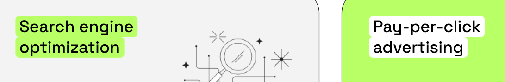

# [Макет ](https://www.figma.com/design/cTj4GV6SrkgMdHfqHRW8oi/Positivus-Landing-Page-Design-(Community)?node-id=330-762&t=CAnOMzgYoUlBoddF-1)

--------

### частина 1

- допрацювати блок "Case Studies"
- винести окремо стилі для зогововків схожих на "Case Studies" для перевикористання стилів
-------

- відтворити частину з "Our Working Process"
- зробити через css акардеони в поточному блоці
-------

- доробити заголовки в блоках  
-------

- Зробити блок "Team"

-------
- вам не потрібно привьязуватись в блоках до висоти
