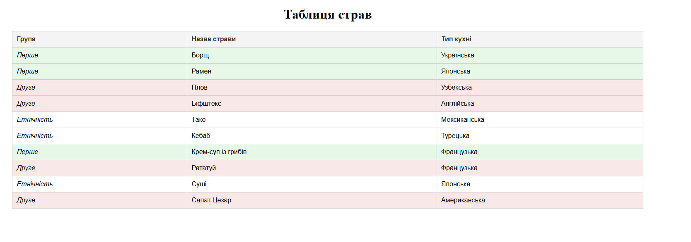

# ### HW_2

### Завдання - Створення таблиці з групами страв і стилями

#### Опис завдання:

Необхідно створити таблицю з даними про страви. Таблиця має містити кілька груп страв (наприклад, "Перше", "Друге" і "Етнічність"). Дані повинні бути представлені у вигляді 10 прикладів страв. До таблиці потрібно додати стилі таким чином, щоб:

1. Деякі комірки змінювали свій фон залежно від сусідніх елементів.
2. Використовувалися каскадні стилі, які передаються через спадкування.
3. Стилі реалізували чітке візуальне розділення груп страв.
4. Додайте пояснення що ви не можете виконати, якщо таке можливо

