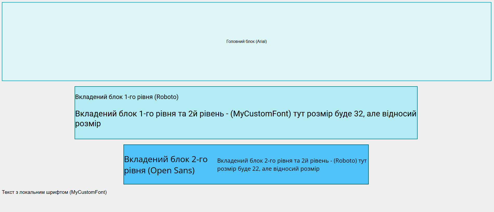

Ось завдання для студентів українською мовою:

### **Завдання для студентів: "Вкладені блоки з текстом та шрифтами"**

#### **Мета завдання**

1. Навчитися створювати вкладені блоки та працювати з відносними і абсолютними розмірами тексту і елементів.
2. Навчитися підключати шрифти локально та з інтернету.
3. Практикувати структурування сторінки HTML та застосування CSS для оформлення.

---

#### **Що потрібно зробити?**

1. **Створити HTML-сторінку** з назвою `index.html`.
2. **Підключити CSS** — можна використовувати стиль всередині HTML або окремий файл `style.css`.
3. **Додати вкладені блоки**:

   - Головний блок (`div`), який займає всю ширину сторінки.
   - Вкладений блок 1-го рівня, розташований всередині головного блоку.
   - Вкладений блок 2-го рівня, розташований всередині вкладеного блоку 1-го рівня.

4. **В кожному блоці розмістити текст**, який відображатиме інформацію про:

   - Назву блоку.
   - Використаний шрифт (локальний чи із Google Fonts).

5. **Налаштувати стилі** для тексту та блоків:

   - Застосувати різні шрифти (мінімум два з інтернету та два локальних).
   - Встановити розміри блоків і тексту, використовуючи `px`, `%`, `em`, `rem`.

6. **Оформити блоки** кольорами або рамками, щоб чітко було видно їхні межі.

7. **Локальне підключення шрифтів**:
   - Завантажте два шрифти з інтернету (можна з [Google Fonts](https://fonts.google.com)) і додайте їх локально в проект.
   - Встановіть ці шрифти через `@font-face` в CSS, щоб вони були доступні в вашому проекті.
     
