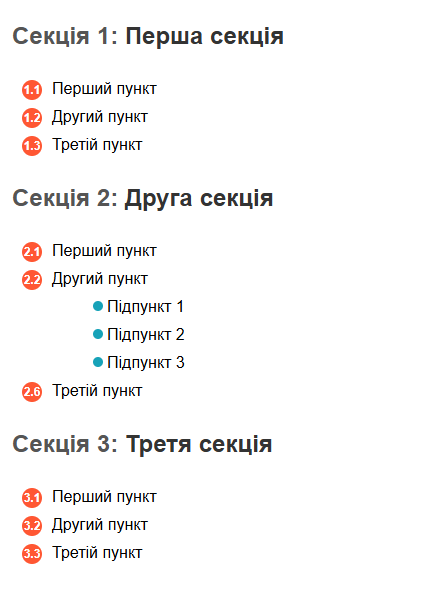

# Завдання: Списки з секціями

## Вимоги

### Секції заголовків

- Для кожної секції додати нумерацію перед заголовком.
- Нумерація має бути автоматичною (через лічильники CSS).

### Списки

- Кожен пункт списку має нумерацію перед текстом.
- Нумерація генерується автоматично через CSS.
- Після тексту кожного пункту має бути декоративна фігура (коло, квадрат, ромб тощо).

### Вкладений список

- Додати вкладений список у другій секції.
- Вкладені пункти повинні мати окрему нумерацію (залежну від нумерації батьківського пункту).
- Декоративна фігура повинна бути частиною лічильника у вкладеному списку.

### Обмеження

- Декоративні елементи створюються тільки за допомогою псевдоелементів `::before` і `::after`.
- Заборонено використовувати явні селектори на зразок `nth-child(2)` для стилів.
  
