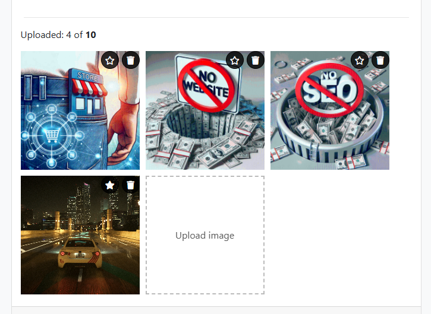

* У файлі gallery.html
1. Якщо немає картинок, лічильник не відображається.
2. У полі `countText` слід вказати кількість завантажених файлів, обмежуючи їх до 10.
3. Якщо картинок 10, приховати блок завантаження картинок. 
4. Якщо користувач хоче завантажити більше 10 картинок, завантажуються лише перші 10, після чого відображається повідомлення про помилку.

